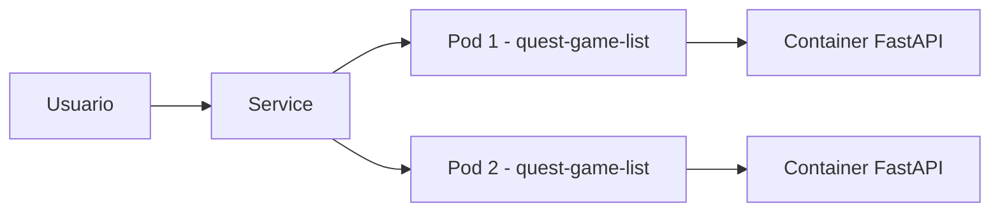

# QuestGameList - Documentacao da Unidade 2

Este documento consolida a entrega da Unidade 2 com evolucao do sistema, Docker, versionamento de imagens, publicacao em registry, pesquisa de Kubernetes e gerencia de configuracao.

## Parte 1 - Evolucao do Sistema

### 1.1 Melhorias visuais
- Refinamento de telas HTML/CSS (login, cadastro, perfil, jogos e procurar).
- Ajustes de responsividade para desktop e mobile.
- Padronizacao visual entre as paginas.

### 1.2 Novos conteudos
- Novas paginas e componentes visuais em `app/templates/`.
- Estilos por tela em `app/static/css/`.
- Navegacao entre login, cadastro, catalogo, perfil e busca.

### 1.3 Organizacao do projeto
- Separacao de backend e arquivos estaticos na pasta `app/`.
- Rotas FastAPI centralizadas em `app/main.py`.
- Pipeline CI em `.github/workflows/ci.yml`.
- Guia de contribuicao em `CONTRIBUTING.md`.

### 1.4 README atualizado
- Este README foi reorganizado por partes, com passos de reproducao e evidencias.

## Parte 2 - Docker

### 2.1 Dockerfile atualizado
- Imagem base: `python:3.10-slim`.
- Instalacao de dependencias por `app/requirements.txt`.
- Inicializacao da aplicacao com Uvicorn.

### 2.2 Criar nova imagem Docker

```bash
docker build -t quest-game-list:local .
```

### 2.3 Rodar aplicacao em container

```bash
docker run --rm -p 8000:8000 quest-game-list:local
```

Alternativa com Compose:

```bash
docker compose up --build
```

### 2.4 Evidencias da aplicacao funcionando em container

Comandos para gerar evidencias:

```bash
docker ps
docker logs quest-game-list
curl -I http://localhost:8000/
```

Evidencias a anexar no relatorio:
- Print do `docker ps` com container em execucao.
- Print do navegador em `http://localhost:8000/`.
- Print do log com inicializacao do Uvicorn sem erro.

## Parte 3 - Versionamento de Imagens

Padrao adotado:

- `hugo-cesar1/quest-game-list:v1`
- `hugo-cesar1/quest-game-list:v2`

### 3.1 O que mudou entre as versoes
- `v1`: versao inicial containerizada.
- `v2`: melhorias visuais, organizacao da documentacao, ajustes de CI e manifesto Kubernetes.

### 3.2 Por que o versionamento e importante
- Permite rastrear entregas por fase.
- Facilita rollback seguro em caso de erro.
- Evita sobrescrever uma imagem sem historico.

### 3.3 Versao da entrega atual
- Versao atual recomendada para entrega: `v2`.

## Parte 4 - Container Registry

### 4.1 Publicacao no Docker Hub

Comandos:

```bash
docker login
docker build -t hugo-cesar1/quest-game-list:v2 .
docker push hugo-cesar1/quest-game-list:v2
```

### 4.2 Informacoes para entrega
- Link Docker Hub: `https://hub.docker.com/r/hugo-cesar1/quest-game-list`
- Nome da imagem: `hugo-cesar1/quest-game-list`
- Versao/tag: `v2`
- Prints: tela da imagem publicada, tags e horario da publicacao.

## Parte 5 - Kubernetes Simplificado

### 5.1 Pesquisa curta
- Kubernetes: plataforma de orquestracao para executar e gerenciar containers em escala.
- Pod: menor unidade de execucao no Kubernetes; encapsula um ou mais containers.
- Deployment: recurso que define estado desejado (quantidade de replicas, atualizacoes, recuperacao).
- Service: camada de rede estavel para expor e balancear acesso aos Pods.
- Como ajuda no sistema: melhora disponibilidade, escalabilidade e recuperacao automatica em falhas.

### 5.2 Representacao simples da arquitetura



Ferramentas aceitas para desenho final: Canva, Figma, Draw.io ou PowerPoint.

## Parte 6 - Arquivo YAML Simples

Arquivo exigido: `deployment.yaml`.

Resumo do arquivo atual:
- `kind: Deployment`
- `replicas: 3`
- imagem `hugo-cesar1/quest-game-list:v1`
- porta do container `8000`
- `kind: Service` para acesso interno

Exemplo minimo esperado (referencia da atividade):

```yaml
apiVersion: apps/v1
kind: Deployment
metadata:
	name: sistema-devops
spec:
	replicas: 2
	selector:
		matchLabels:
			app: sistema-devops
	template:
		metadata:
			labels:
				app: sistema-devops
		spec:
			containers:
				- name: sistema-devops
					image: usuario/sistema:v2
					ports:
						- containerPort: 80
```

## Parte 7 - Escalabilidade

### 7.1 Como o Kubernetes ajudaria com muitos usuarios
Ele permite aumentar automaticamente a quantidade de instancias (Pods), distribuindo as requisicoes e reduzindo sobrecarga.

### 7.2 O que significa aumentar replicas
Significa executar mais copias da aplicacao para atender mais requisicoes ao mesmo tempo.

### 7.3 O que pode acontecer se um Pod falhar
O Deployment recria o Pod automaticamente para manter o numero desejado de instancias, reduzindo indisponibilidade.

## Parte 8 - Gerencia de Configuracao

### 8.1 Itens de Configuracao do Projeto
- Codigo-fonte (`app/main.py`, templates e CSS): controla evolucao funcional e visual.
- Dockerfile: define ambiente de execucao reproduzivel.
- README.md: documenta uso, arquitetura e processo de entrega.
- Workflows GitHub Actions (`.github/workflows/ci.yml`): garante validacao automatica.
- Imagem Docker (`hugo-cesar1/quest-game-list:v1`, `:v2`): empacotamento versionado da aplicacao.
- Arquivos YAML (`deployment.yaml`): descrevem deploy em Kubernetes.
- Documentacao de colaboracao (`CONTRIBUTING.md` e template de PR): padronizam mudancas.
- Dependencias (`app/requirements.txt`): fixam bibliotecas necessarias.

### 8.2 Baseline do Projeto
- Nome da baseline: `Baseline_Unidade_2`
- Versao associada: `v2.0.0`
- Arquivos da baseline:
	- `README.md`
	- `Dockerfile`
	- `deployment.yaml`
	- `.github/workflows/ci.yml`
	- `app/main.py`
	- `app/requirements.txt`
- Justificativa de estabilidade: versao com documentacao consolidada, containerizacao, CI e manifesto de deploy definidos.

### 8.3 Estrategia de Versionamento
Modelo: `MAJOR.MINOR.PATCH`

- `v1.0.0`: entrega da primeira unidade.
- `v2.0.0`: entrega da segunda unidade (Docker, CI, YAML, documentacao).
- `v2.0.1`: correcao de bugs sem alteracao estrutural.

### 8.4 Controle de Mudancas

Mudanca 1
- Descricao: reorganizacao da estrutura de projeto e documentacao.
- Itens impactados: `README.md`, `CONTRIBUTING.md`, template de PR.
- Motivo: padronizar colaboracao e entrega.
- Impacto: melhora rastreabilidade e onboarding.
- Status: Concluida.

Mudanca 2
- Descricao: atualizacao da execucao em container e Compose.
- Itens impactados: `Dockerfile`, `docker-compose.yml`.
- Motivo: facilitar reproducao em equipe.
- Impacto: reducao de erros de ambiente local.
- Status: Concluida.

Mudanca 3
- Descricao: criacao/ajuste de manifesto Kubernetes e CI automatica.
- Itens impactados: `deployment.yaml`, `.github/workflows/ci.yml`.
- Motivo: preparar projeto para escalabilidade e validacao continua.
- Impacto: maior confiabilidade e padrao de deploy.
- Status: Concluida.

### 8.5 Solicitacao de Mudanca (ficticia)
- Titulo da mudanca: Integracao com API externa de catalogo de jogos.
- Descricao da mudanca: substituir mock local por fonte real de dados.
- Motivo da mudanca: ampliar cobertura e atualizacao do catalogo.
- Itens impactados: `app/main.py`, `app/requirements.txt`, testes e CI.
- Impacto tecnico: aumento de complexidade e chamadas HTTP externas.
- Riscos envolvidos: timeout, indisponibilidade da API externa, limites de rate.
- Prioridade: Media.
- Necessidade de testes: Sim (integracao e resiliencia).
- Decisao: Aprovada para backlog da proxima unidade.

### 8.6 Auditoria de Configuracao

| Item verificado | Conforme? | Observacao |
|---|---|---|
| README atualizado | Sim | Estruturado por partes e com passos de entrega. |
| Dockerfile presente | Sim | Configurado para executar FastAPI em container. |
| deployment.yaml presente | Sim | Deployment e Service definidos. |
| Imagem Docker versionada | Sim | Estrategia com tags `v1` e `v2`. |
| Link do Docker Hub correto | Pendente validacao | Confirmar URL final publicada pela equipe. |
| Baseline definida | Sim | `Baseline_Unidade_2` documentada. |
| Mudancas registradas | Sim | Tres mudancas descritas na secao 8.4. |

### 8.7 Gerencia de Dependencias

Quais dependencias o projeto utiliza?
- Python 3.10 (imagem base Docker)
- FastAPI
- Uvicorn
- Jinja2

Onde essas dependencias estao registradas?
- `app/requirements.txt`
- `Dockerfile` (imagem base)

Qual risco existe se uma dependencia for atualizada sem teste?
- Quebra de compatibilidade, falha de inicializacao, erro de runtime e regressao visual/funcional.

Como controlar atualizacoes?
- Atualizar em branch dedicada.
- Rodar CI automaticamente.
- Validar local e em container.
- Aprovar por Pull Request com revisao.

## Estrutura obrigatoria do repositorio

Minimo exigido:

```text
README.md
Dockerfile
deployment.yaml
.github/workflows/
```

Estrutura atual do projeto:

```text
quest-game-list/
├── .github/
│   ├── pull_request_template.md
│   └── workflows/
│       └── ci.yml
├── app/
│   ├── main.py
│   ├── requirements.txt
│   ├── static/
│   └── templates/
├── CONTRIBUTING.md
├── deployment.yaml
├── Dockerfile
├── docker-compose.yml
└── README.md
```
